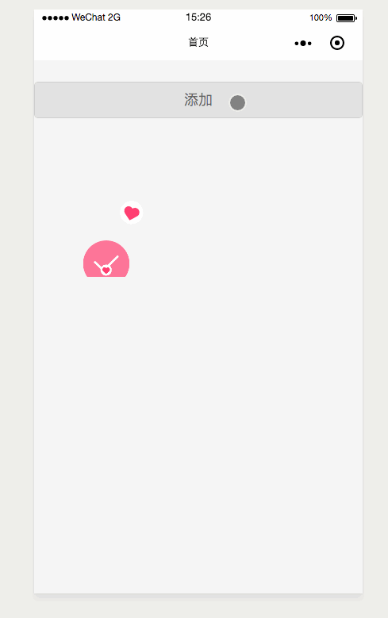

# 使用

> 原生小程序

- 如果 小程序基础库版本 >= 2.2.1 [小程序原生 npm 支持， 需要下载 beta 开发者工具](https://developers.weixin.qq.com/miniprogram/dev/devtools/npm.html)

```zsh
// 项目中安装 mini-program-utils
npm install mini-program-utils --production
```

```js
const miniUtils = require('mini-program-utils').default

const { drawQrCode, Bubble, Socket } = miniUtils
.....
```

<!-- `Tips:` 原生支持的 npm 策略会将依赖的文件全部打包入 index.js, 造成冗余 -->

- 如果 < 2.2.1

  将 dist 目录中对应文件模块拷贝到项目中使用, dist 目录文件已经经过 babel 转译

> 基于 wepy 框架

[wepy 框架 github 地址](https://github.com/Tencent/wepy)

```zsh
// yarn
yarn add mini-program-utils
// npm
npm install mini-program-utils
```

# socket 模块

## Socket(url, opts)

- 参数:

  - `{ String } url`
  - `{ Object } opts`
    - `{ Number } [timeout]`: 重连间隔时间
    - `{ Number } [maxAttempts]`: 尝试重连最大次数
    - `{ Function } [onMessage]`: 下行消息回掉函数
    - `{ Function } [onClose]`: 链接关闭回掉函数
    - `{ Function } [onError]`: 链接链接异常回掉函数
    - `{ Function } [onOpen]`: 链接打开回掉函数
    - `{ Function } [onReconnect]`: 链接重连回掉函数
    - `{ Function } [onMaximum]`: 重连达到最大次数回掉函数

- 默认

```js
opts = {
  timeout: 1e3,
  maxAttempts: Infinity
}
```

- 使用:

  构造一个 socket 实例:

  ```js
  import Socket from 'mini-program-utils/dist/socket'

  const socket = new Socket('xxxx', {
    timeout: 1e3,
    maxAttempts: Infinity,
    onOpen(e) {
      console.log('onOpen: ', e)
    },
    onMessage(data) {
      console.log('onMessage: ', data)
    },
    onClose(e) {
      console.log('onClose: ', e)
    },
    onError(e) {
      console.log('onError: ', e)
    },
    onReconnect(e) {
      console.log('onReconnect: ', e)
    },
    onMaximum(e) {
      console.log('onMaximum: ', e)
    }
  })
  ```

## 实例方法

### send(data)

- 参数

  - `{ Object } data`

- 使用

```js
socket.send({
  cmd: 'xxx',
  data: {
    cor: '伊的家'
  }
})
```

### close([code, reason])

- 参数

  - `{ Number } [code]`
  - `{ String } [reason]`

- 使用

```js
socket.close()
```

## 事件

> 以下事件参数与微信小程序 [`socket`](https://developers.weixin.qq.com/miniprogram/dev/api/socket-task.html) 回掉函数参数 一致

### onOpen(e)

### onMessage(e)

### onClose(e)

### onError(e)

### onReconnect(e)

- 同`onError`事件参数

### onMaximum(e)

- 同`onError`事件参数

# qrcode 二维码

> 本想仿照 jquery-qrcode 写个库，基于 qrcode.js 这个库.但是搜索发现已有 weapp-qrcode 已实现了，但是不满足 业务需求,在 weapp-qrcode 基础上，增加了一些属性.

## drawQrcode(options)

- 参数

  - `{ Object } options`

    - `{ String } canvasId`: 小程序 canvas id
    - `{ String } [text]`: 二维码内容
    - `{ Number } [sx]`: canvas x 坐标轴
    - `{ Number } [sy]`: canvas y 坐标轴
    - `{ Boolean } [reserve]`: 是否接着上一次绘制
    - `{ Number } [width]`: 二维码宽度
    - `{ Number } [height]`: 二维码高度
    - `{ Number } [typeNumber]`: 二维码的计算模式，默认值-1
    - `{ Number } [correctLevel]`: 二维码纠错级别，默认值为高级，取值：`{ L: 1, M: 0, Q: 3, H: 2 }`
    - `{ String } [background]`: 二维码背景颜色
    - `{ String } [foreground]`: 二维码前景色

* 默认

```js
options = {
  text: '',
  sx: 0,
  sy: 0,
  reserve: false,
  width: 256,
  height: 256,
  typeNumber: -1,
  correctLevel: QRErrorCorrectLevel.H,
  background: '#ffffff',
  foreground: '#000000'
}
```

- 使用

```js
import drawQrCode from 'mini-program-utils/dist/qrcode'
drawQrCode({
  canvasId: '',
  text: 'https://onlylonger.github.io/mini-program-utils',
  sx: 0,
  sy: 0,
  reserve: false,
  width: 256,
  height: 256,
  typeNumber: -1,
  correctLevel: QRErrorCorrectLevel.H,
  background: '#ffffff',
  foreground: '#000000'
})
```

# bubble 图片冒泡特效



## Bubble(ops)

- 参数

  - `{ Object } ops`

    - `{ String } canvasId`: 小程序 canvas id
    - `{ Number } canvasWidth`: canvas 的宽度 px
    - `{ Number } canvasHeight`: canvas 的宽度 px

- 使用

```js
import Bubble from 'mini-program-utils/dist/bubble'
// 小程序 规定屏幕宽为750rpx
const sysInfo = wx.getSystemInfoSync()
const radio = sysInfo.windowWidth / 750

const bubble = new Bubble({
  canvasId: 'firstCanvas',
  canvasWidth: radio * 300,
  canvasHeight: radio * 400
})
```

## setEntity(entity)

- 参数

  - `{ Object } entity`

    - `{ String } url`: 图片本地地址, 暂不支持网络资源
    - `{ String } width`: 图片的宽度 px
    - `{ String } height`: 图片的高度 px
    - `{ Number } duration`: 图片动画时间 毫秒
    - `{ Function } endCb`: 图片消失前回掉函数

- 使用

```js
import random from 'lodash.random'

const ary = [
  {
    url: '../imgs/icon_heart.png',
    width: radio * 50,
    height: radio * 50,
    endCb() {
      console.log('okla')
    }
  },
  {
    url: '../imgs/success.png',
    width: 100 * radio,
    height: 100 * radio
  }
]
const num = random(0, ary.length - 1)
this.bubble.setEntity(ary[num])
```
